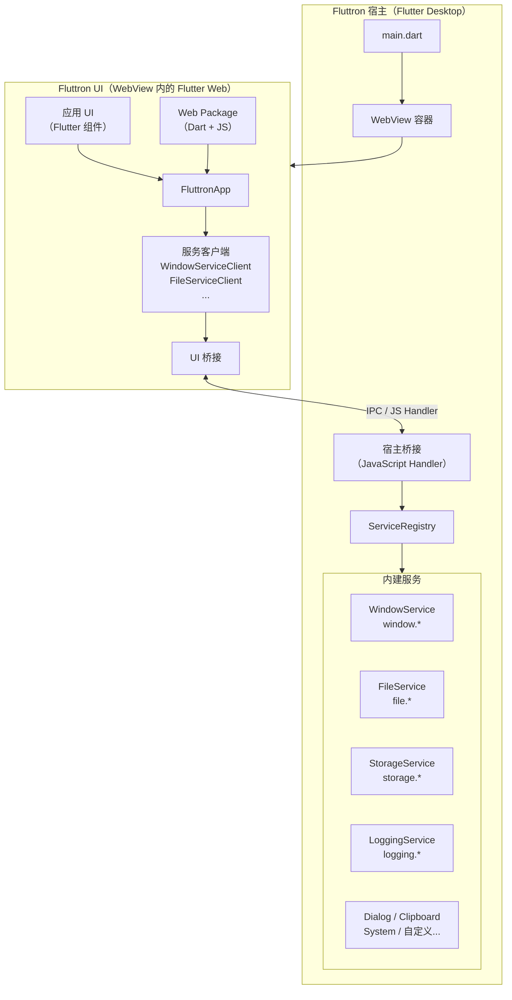

# Fluttron

**使用 Flutter + Web 生态构建跨端桌面应用——全程 Dart，一语到底。**

[](https://github.com/maxiee/Fluttron/actions/workflows/ci.yml)
[](https://github.com/maxiee/Fluttron/releases)
[](LICENSE)

[English](README.md)

---

## Fluttron 是什么？

Fluttron 是面向 Dart 和 Flutter 开发者的桌面应用框架，灵感来自 Electron。它将 **Flutter Desktop 宿主**（原生 Dart 运行时）与 **Flutter Web 渲染层**（运行在 WebView 内）结合，通过类型安全的双向 IPC 桥接相连。

宿主层用 Dart 编写——可原生访问文件系统、窗口管理和平台服务。UI 层用 Flutter Web 编写——可完整使用 JavaScript 生态。两层共享同一套 Dart 语言、同一套类型定义和同一套代码生成工具链。

---

## 为什么选择 Fluttron？

|  | Electron | Tauri | Flutter Desktop | **Fluttron** |
|---|---|---|---|---|
| 宿主语言 | Node.js | Rust | Dart | **Dart** |
| UI 层 | HTML / CSS / JS | HTML / CSS / JS | Flutter 组件 | **Flutter Web + JS** |
| Web 生态接入 | 完整 | 完整 | 无 | **完整** |
| 类型安全 IPC | 手动 | Rust 宏 | N/A | **Dart 代码生成** |
| 包体积（典型） | 120–200 MB | 2–10 MB | 15–30 MB | ~50 MB |
| 移动端支持 | 否 | 部分（v2） | 是 | 规划中 |
| 主要语言 | JavaScript | Rust | Dart | **Dart** |

**Fluttron 的独特定位**：如果你是 Flutter 开发者，需要接入 Web 生态（富文本编辑器、图表、地图、JS 库），Fluttron 让你无需切换到 Node.js 或 Rust，用 Dart 一语统领宿主逻辑和 UI。

---

## 快速上手

**前置条件**：Flutter SDK（stable 渠道，已启用 macOS 桌面支持）、Node.js ≥ 18、pnpm

```bash
# 1. 安装 Fluttron CLI
dart pub global activate --path packages/fluttron_cli

# 2. 检查开发环境
fluttron doctor

# 3. 创建新应用
fluttron create ./hello_fluttron --name HelloFluttron

# 4. 构建 UI 并同步资产
fluttron build -p ./hello_fluttron

# 5. 运行
fluttron run -p ./hello_fluttron
```

打包可分发的 `.app` 应用包：

```bash
fluttron package -p ./hello_fluttron
# 输出：./hello_fluttron/dist/HelloFluttron.app

fluttron package -p ./hello_fluttron --dmg
# 输出：./hello_fluttron/dist/HelloFluttron.dmg
```

---

## 功能特性

### CLI 命令

| 命令 | 说明 |
|---|---|
| `fluttron create <path>` | 创建新的 Fluttron 应用 |
| `fluttron create <path> --type web_package` | 创建可复用 Web Package |
| `fluttron create <path> --type host_service` | 创建自定义宿主服务（宿主包 + 客户端包） |
| `fluttron build -p <path>` | 构建 UI、同步资产、生成注册代码 |
| `fluttron run -p <path>` | 运行 Flutter Desktop 宿主 |
| `fluttron package -p <path>` | 构建 Release `.app` 包 |
| `fluttron package -p <path> --dmg` | 构建 `.dmg` 磁盘镜像 |
| `fluttron packages list -p <path>` | 诊断已发现的 Web Package |
| `fluttron generate services --contract <file>` | 从服务契约生成 Host/Client/Model 代码 |
| `fluttron doctor` | 检查开发环境依赖 |
| `fluttron --version` | 查看 CLI 版本 |

### 内建宿主服务

所有服务开箱即用，无需配置：

| 服务 | 命名空间 | 能力 |
|---|---|---|
| `WindowService` | `window.*` | setTitle、setSize、getSize、minimize、maximize、setFullScreen、center、setMinSize |
| `FileService` | `file.*` | read、write、list、exists、delete、stat、mkdir、rename |
| `DialogService` | `dialog.*` | openFile、saveFile、openDirectory、message |
| `ClipboardService` | `clipboard.*` | getText、setText |
| `SystemService` | `system.*` | getPlatform、getLocale、openUrl |
| `StorageService` | `storage.*` | kvGet、kvSet、kvDelete（持久化键值存储） |
| `LoggingService` | `logging.*` | log、getLogs、clear（环形缓冲，默认 1000 条） |

### 类型安全桥接与代码生成

用 Dart 定义服务契约：

```dart
@FluttronServiceContract(namespace: 'todo')
abstract class TodoServiceContract {
  Future<List<TodoItem>> getTodos();
  Future<void> addTodo({required String title});
  Future<void> deleteTodo({required String id});
}
```

一键生成宿主实现、类型化客户端和模型类：

```bash
fluttron generate services --contract todo_contract.dart
```

### Web Package 系统

将 Flutter 组件、JavaScript 和 CSS 打包为可复用的 Web Package 分发。应用在构建时自动发现、收集并注册所有 Web Package。

---

## 架构



**三层架构：**

1. **宿主层**（Flutter Desktop）：窗口生命周期、服务注册、原生平台访问——全部 Dart。
2. **桥接层**（WebView JS Handler）：类型化 `FluttronRequest` / `FluttronResponse` IPC，按 `namespace.method` 路由。
3. **UI 层**（WebView 内的 Flutter Web）：Flutter 组件 + 通过 Web Package 访问完整 JS 生态。

---

## 示例应用

### markdown_editor

生产级 Markdown 编辑器，完整演示：
- 文件系统操作（打开目录、文件树、加载/保存与脏状态管理）
- 通过 `WindowServiceClient` 动态设置窗口标题
- 通过 `LoggingServiceClient` 记录关键操作日志
- 通过 `StorageServiceClient` 持久化主题偏好
- 通过 `fluttron_milkdown` Web Package 实现富文本编辑

```
examples/markdown_editor/
```

### host_service_demo

演示如何使用 `fluttron create --type host_service` 和 `fluttron generate services` 创建并集成自定义宿主服务。

```
examples/host_service_demo/
```

### playground

最小化 Fluttron 应用，用于框架探索与功能测试。

```
playground/
```

---

## 文档

**官方文档**：[https://maxiee.github.io/Fluttron/](https://maxiee.github.io/Fluttron/)

文档内容包括：
- [快速入门](https://maxiee.github.io/Fluttron/docs/getting-started/installation) — 安装与第一个应用
- [内建服务](https://maxiee.github.io/Fluttron/docs/api/services) — 完整服务 API 参考
- [自定义服务](https://maxiee.github.io/Fluttron/docs/getting-started/custom-services) — 创建自己的宿主服务
- [服务代码生成](https://maxiee.github.io/Fluttron/docs/api/codegen) — 契约驱动的代码生成
- [Web Package](https://maxiee.github.io/Fluttron/docs/api/web-packages) — 打包 Dart + JS 组件

---

## 项目结构

```
Fluttron/
├── packages/
│   ├── fluttron_cli/       # CLI 工具（dart pub global activate 安装）
│   ├── fluttron_shared/    # 协议、模型、注解
│   ├── fluttron_host/      # Flutter Desktop 运行时 + 所有宿主服务
│   └── fluttron_ui/        # Flutter Web 框架 + 服务客户端
├── web_packages/
│   └── fluttron_milkdown/  # Milkdown 富文本编辑器 Web Package
├── templates/              # 项目脚手架模板
├── examples/               # 示例应用
│   ├── markdown_editor/
│   └── host_service_demo/
├── playground/             # 开发沙箱
└── website/                # Docusaurus 文档站点
```

---

## 参与贡献

欢迎提交 Issue 和 PR！请阅读 [CONTRIBUTING.md](CONTRIBUTING.md) 了解环境搭建、编码规范与 PR 流程。

- [提交 Bug](.github/ISSUE_TEMPLATE/bug_report.md)
- [功能请求](.github/ISSUE_TEMPLATE/feature_request.md)
- [安全政策](SECURITY.md)

---

## 许可证

MIT © [Maxiee](https://github.com/maxiee)

详见 [LICENSE](LICENSE)。
