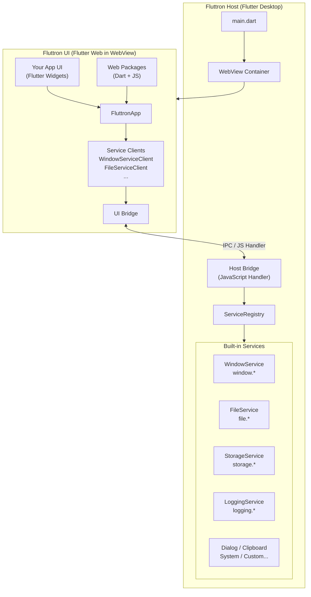

# Fluttron

**Build cross-platform desktop apps with Flutter + the Web ecosystem — Dart all the way down.**

[](https://github.com/maxiee/Fluttron/actions/workflows/ci.yml)
[](https://github.com/maxiee/Fluttron/releases)
[](LICENSE)

[中文](README-zh.md)

---

## What is Fluttron?

Fluttron is an Electron-inspired desktop application framework for Dart and Flutter developers. It combines a **Flutter Desktop host** (native Dart runtime) with a **Flutter Web renderer** (running inside a WebView), connected by a typed, bidirectional IPC bridge.

You write the host in Dart — with native access to the file system, window management, and platform services. You write the UI in Flutter Web — with full access to the JavaScript ecosystem. Both layers share the same Dart language, the same type definitions, and the same codegen toolchain.

---

## Why Fluttron?

|  | Electron | Tauri | Flutter Desktop | **Fluttron** |
|---|---|---|---|---|
| Host language | Node.js | Rust | Dart | **Dart** |
| UI layer | HTML / CSS / JS | HTML / CSS / JS | Flutter widgets | **Flutter Web + JS** |
| Web ecosystem access | Full | Full | None | **Full** |
| Type-safe IPC | Manual | Rust macros | N/A | **Dart codegen** |
| Bundle size (typical) | 120–200 MB | 2–10 MB | 15–30 MB | ~50 MB |
| Mobile support | No | Partial (v2) | Yes | Planned |
| Primary language | JavaScript | Rust | Dart | **Dart** |

**Fluttron's unique position**: If you are a Flutter developer who needs the Web ecosystem (rich text editors, charts, maps, JS libraries), Fluttron lets you keep Dart as your one language for both host logic and UI, without switching to Node.js or Rust.

---

## Quick Start

**Prerequisites**: Flutter SDK (stable, macOS desktop enabled), Node.js ≥ 18, pnpm

```bash
# 1. Install the Fluttron CLI
dart pub global activate --path packages/fluttron_cli

# 2. Check your environment
fluttron doctor

# 3. Create a new app
fluttron create ./hello_fluttron --name HelloFluttron

# 4. Build the UI and sync assets
fluttron build -p ./hello_fluttron

# 5. Run
fluttron run -p ./hello_fluttron
```

To package a distributable `.app` bundle:

```bash
fluttron package -p ./hello_fluttron
# Output: ./hello_fluttron/dist/HelloFluttron.app

fluttron package -p ./hello_fluttron --dmg
# Output: ./hello_fluttron/dist/HelloFluttron.dmg
```

---

## Features

### CLI

| Command | Description |
|---|---|
| `fluttron create <path>` | Scaffold a new Fluttron app |
| `fluttron create <path> --type web_package` | Scaffold a reusable Web Package |
| `fluttron create <path> --type host_service` | Scaffold a custom host service (host + client packages) |
| `fluttron build -p <path>` | Build UI, sync assets, generate registrations |
| `fluttron run -p <path>` | Run the Flutter Desktop host |
| `fluttron package -p <path>` | Build a release `.app` bundle |
| `fluttron package -p <path> --dmg` | Build a `.dmg` disk image |
| `fluttron packages list -p <path>` | Diagnose discovered Web Packages |
| `fluttron generate services --contract <file>` | Generate Host/Client/Model from a service contract |
| `fluttron doctor` | Check development environment prerequisites |
| `fluttron --version` | Print CLI version |

### Built-in Host Services

All services are available immediately — no configuration required:

| Service | Namespace | Capabilities |
|---|---|---|
| `WindowService` | `window.*` | setTitle, setSize, getSize, minimize, maximize, setFullScreen, center, setMinSize |
| `FileService` | `file.*` | read, write, list, exists, delete, stat, mkdir, rename |
| `DialogService` | `dialog.*` | openFile, saveFile, openDirectory, message |
| `ClipboardService` | `clipboard.*` | getText, setText |
| `SystemService` | `system.*` | getPlatform, getLocale, openUrl |
| `StorageService` | `storage.*` | kvGet, kvSet, kvDelete (persistent key-value store) |
| `LoggingService` | `logging.*` | log, getLogs, clear (ring buffer, 1000 entries) |

### Type-Safe Bridge & Codegen

Define a service contract in Dart:

```dart
@FluttronServiceContract(namespace: 'todo')
abstract class TodoServiceContract {
  Future<List<TodoItem>> getTodos();
  Future<void> addTodo({required String title});
  Future<void> deleteTodo({required String id});
}
```

Generate host implementation, typed client, and model classes:

```bash
fluttron generate services --contract todo_contract.dart
```

### Web Package System

Package and distribute reusable UI components that bundle Flutter widgets, JavaScript, and CSS together. Your app automatically discovers, collects, and registers all Web Packages at build time.

---

## Architecture



**Three layers:**

1. **Host** (Flutter Desktop): window lifecycle, service registry, native platform access — all in Dart.
2. **Bridge** (WebView JS Handler): typed `FluttronRequest` / `FluttronResponse` IPC, routed by `namespace.method`.
3. **UI** (Flutter Web inside WebView): Flutter widgets + full JS ecosystem access via Web Packages.

---

## Examples

### markdown_editor

A production-grade Markdown editor demonstrating:
- File system access (open folder, file tree, load/save with dirty state)
- Dynamic window title via `WindowServiceClient`
- Operation logging via `LoggingServiceClient`
- Theme switching with persistence via `StorageServiceClient`
- Rich text editing via the `fluttron_milkdown` Web Package

```
examples/markdown_editor/
```

### host_service_demo

Shows how to create and integrate a custom host service using `fluttron create --type host_service` and `fluttron generate services`.

```
examples/host_service_demo/
```

### playground

Minimal Fluttron app for framework exploration and testing.

```
playground/
```

---

## Documentation

**Official docs**: [https://maxiee.github.io/Fluttron/](https://maxiee.github.io/Fluttron/)

Documentation covers:
- [Getting Started](https://maxiee.github.io/Fluttron/docs/getting-started/installation) — installation, first app
- [Built-in Services](https://maxiee.github.io/Fluttron/docs/api/services) — complete service API reference
- [Custom Services](https://maxiee.github.io/Fluttron/docs/getting-started/custom-services) — create your own host service
- [Service Codegen](https://maxiee.github.io/Fluttron/docs/api/codegen) — contract-driven code generation
- [Web Packages](https://maxiee.github.io/Fluttron/docs/api/web-packages) — bundling Dart + JS components

---

## Project Structure

```
Fluttron/
├── packages/
│   ├── fluttron_cli/       # CLI tool (dart pub global activate)
│   ├── fluttron_shared/    # Protocols, models, annotations
│   ├── fluttron_host/      # Flutter Desktop runtime + all host services
│   └── fluttron_ui/        # Flutter Web framework + service clients
├── web_packages/
│   └── fluttron_milkdown/  # Milkdown rich-text editor Web Package
├── templates/              # Project scaffolding templates
├── examples/               # Example apps
│   ├── markdown_editor/
│   └── host_service_demo/
├── playground/             # Development sandbox
└── website/                # Docusaurus documentation site
```

---

## Contributing

Contributions are welcome! See [CONTRIBUTING.md](CONTRIBUTING.md) for setup instructions, coding standards, and the pull request process.

- [Bug Reports](.github/ISSUE_TEMPLATE/bug_report.md)
- [Feature Requests](.github/ISSUE_TEMPLATE/feature_request.md)
- [Security Policy](SECURITY.md)

---

## License

MIT © [Maxiee](https://github.com/maxiee)

See [LICENSE](LICENSE) for details.
