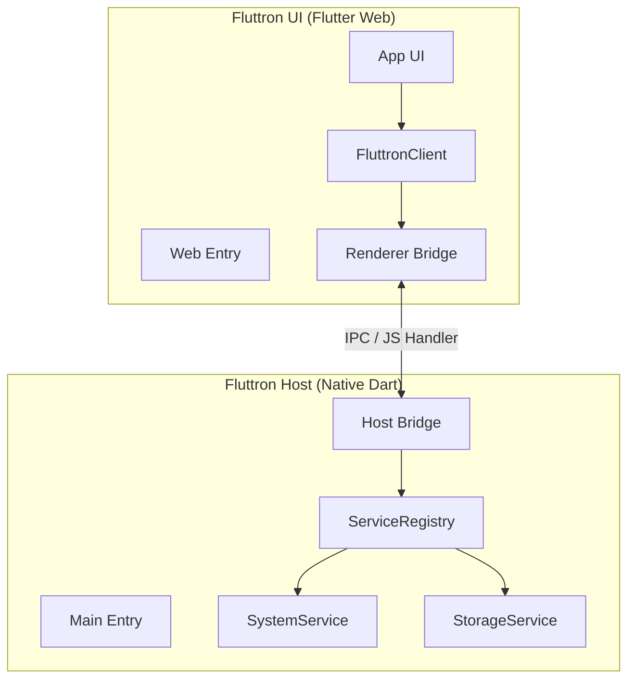

# Fluttron

Dart-native cross-platform container OS.

Electron inspired, but built for Dart and Flutter developers.

## Why Fluttron

Fluttron keeps the Host layer and Renderer layer in the Dart ecosystem:

- Host: Flutter app with native lifecycle and service capabilities.
- Renderer: Flutter Web app running inside WebView.
- Bridge: JSON-based IPC between Host and Renderer.

You can keep Flutter for UI while still integrating Web ecosystem assets when needed.

## Architecture

Fluttron uses a dual-layer architecture:

- Host (`Flutter Desktop`): window, lifecycle, service registry.
- Renderer (`Flutter Web`): UI + business logic in WebView.
- Bridge (`JavaScript Handler`): request/response IPC.



## Current Status (MVP)

- [x] Host and Renderer split architecture
- [x] Host <-> Renderer bridge protocol
- [x] Service registry with `system` and `storage`
- [x] CLI `create/build/run` pipeline
- [x] Template frontend pipeline (`pnpm` + `esbuild`) with JS asset validation
- [x] Core UI library:
  - `FluttronHtmlView` - Embed Web content into Flutter Web
  - `FluttronEventBridge` - JS→Flutter event communication
  - `FluttronWebViewRegistry` - Type-driven view registration
- [x] Host custom service extension with template example
- [ ] Plugin system
- [ ] Typed bridge codegen

## Quick Start

Prerequisites:

- Flutter SDK (stable) with macOS desktop support
- Node.js
- pnpm (via Corepack or direct install)

From repo root:

```bash
dart pub global activate --path packages/fluttron_cli
fluttron create ./hello_fluttron --name HelloFluttron
fluttron build -p ./hello_fluttron
fluttron run -p ./hello_fluttron
```

Without global CLI:

```bash
dart run packages/fluttron_cli/bin/fluttron.dart create ./hello_fluttron --name HelloFluttron
dart run packages/fluttron_cli/bin/fluttron.dart build -p ./hello_fluttron
dart run packages/fluttron_cli/bin/fluttron.dart run -p ./hello_fluttron
```

## Template Frontend Assets

Default template frontend contract:

- Source: `ui/frontend/src/main.js`
- Runtime output: `ui/web/ext/main.js`
- Optional CSS output: `ui/web/ext/main.css`
- Clean behavior: `pnpm run js:clean` removes JS/CSS outputs and sourcemaps

During `fluttron build`, UI web output is copied to Host assets (`host/assets/www`).

## Documentation

- Official docs: [https://maxiee.github.io/Fluttron/](https://maxiee.github.io/Fluttron/)
- Internal development plan: `docs/dev_plan.md`
- Template and manifest spec: `docs/templating.md`

## Contributing

Issues and PRs are welcome.
