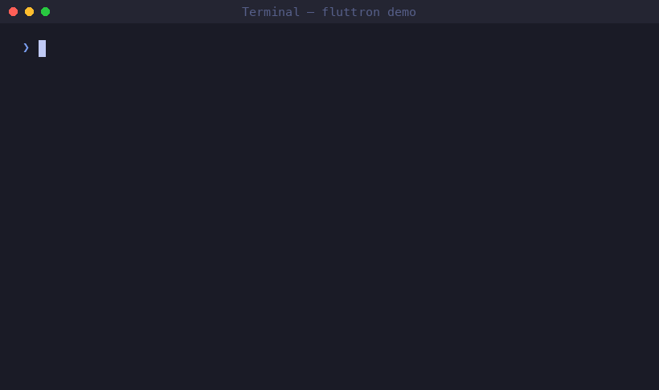
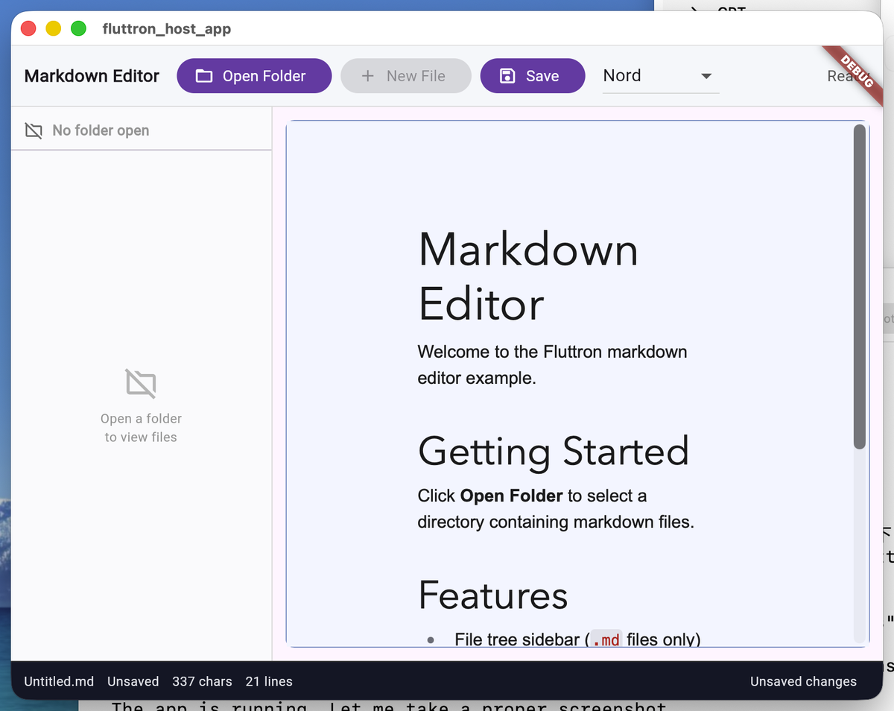

# Introducing Fluttron: The Electron Alternative for Flutter Developers

_February 2026 — v0.1.0-alpha_

---

## The Problem

Flutter Desktop is excellent for building native UI with Dart. But there's a category of desktop application it handles poorly: **apps that need to embed rich web ecosystem components**.

Think about the tools developers actually build:

- A rich-text editor that leverages ProseMirror or Milkdown
- A dashboard that embeds Chart.js or D3
- A code editor using CodeMirror or Monaco
- A presentation tool built on Reveal.js

These components have years of polish, active communities, and deep JS ecosystems. Rewriting them in Flutter widgets means rebuilding years of work from scratch — or shipping something noticeably inferior.

**The options before Fluttron:**

- **Electron**: Powerful, but forces you out of Dart into Node.js. Heavy: 120–200 MB bundles. Two runtimes to maintain.
- **Tauri**: Lightweight and Rust-native, but you're writing Rust for the host. Thin ecosystem integration.
- **Flutter Desktop alone**: Pure Dart, but zero access to the JS ecosystem. You either build everything yourself or go without.
- **flutter_inappwebview (raw)**: You embed a WebView directly, but there's no structure — no typed IPC, no service registry, no codegen, no CLI toolchain. Just you and `evaluateJavascript`.

None of these fit the profile of a Flutter developer who wants to stay in Dart while still reaching the richness of the web ecosystem. That's the gap Fluttron fills.

---

## What is Fluttron?

Fluttron is an Electron-inspired desktop application framework for Dart and Flutter developers. It combines a **Flutter Desktop host** with a **Flutter Web renderer** running inside a WebView, connected by a typed, bidirectional IPC bridge.

```
┌─────────────────────────────────────────────────────────┐
│              Fluttron Host (Flutter Desktop)              │
│                                                           │
│  main.dart ──► ServiceRegistry ──► WindowService         │
│                                ──► FileService            │
│                                ──► StorageService         │
│                                ──► Your Custom Services   │
│                                                           │
│  WebView Container ◄──────────────────────────────────── │
└──────────────┬──────────────────────────────────────────┘
               │  IPC Bridge (WebView JS Handler)
               │  FluttronRequest / FluttronResponse
┌──────────────┴──────────────────────────────────────────┐
│              Fluttron UI (Flutter Web in WebView)         │
│                                                           │
│  FluttronApp ──► WindowServiceClient                      │
│              ──► FileServiceClient                        │
│              ──► Your App Widgets                         │
│              ──► Web Packages (Flutter + JS/CSS)          │
└─────────────────────────────────────────────────────────┘
```

**Three layers:**

1. **Host** (Flutter Desktop): Native platform access — window management, file system, dialogs, clipboard, persistent storage, structured logging. All written in Dart.
2. **Bridge** (WebView JS Handler): Typed `FluttronRequest` / `FluttronResponse` messages, routed by `namespace.method`. Bidirectional — UI calls host services; host can push events to UI.
3. **UI** (Flutter Web inside WebView): Your app's UI is a Flutter Web application — full Flutter widget tree, full JS ecosystem via Web Packages.

The key insight: **both layers are Dart**. The same language, the same type system, the same toolchain. The bridge just carries messages between two Dart programs that happen to run in different contexts.

---

## Key Features

### 1. CLI Toolchain

```bash
# Scaffold a new app
fluttron create ./my_app --name MyApp

# Build UI, sync assets, generate registrations
fluttron build -p ./my_app

# Run
fluttron run -p ./my_app

# Package to distributable .app / .dmg
fluttron package -p ./my_app
fluttron package -p ./my_app --dmg
```

The CLI handles the complexity of a two-layer build: it compiles Flutter Web, runs the JavaScript build pipeline, collects Web Package assets, injects them into the HTML, generates registration code, and wires everything together. You just run `fluttron build`.

### 2. Built-in Host Services

Every Fluttron app ships with seven ready-to-use host services:

| Service | What It Does |
|---|---|
| `WindowService` | Set title, resize, minimize, maximize, fullscreen |
| `FileService` | Read, write, list, stat, rename, delete files and directories |
| `DialogService` | Native open/save file dialogs and directory pickers |
| `ClipboardService` | Read and write the system clipboard |
| `SystemService` | Get platform, locale, open URLs in default browser |
| `StorageService` | Persistent key-value store (survives app restarts) |
| `LoggingService` | Structured ring-buffer logging (1000 entries, debug/info/warn/error) |

Each service has both a host-side implementation and a typed Dart client in `fluttron_ui`. To call a service from your Flutter Web UI:

```dart
final window = WindowServiceClient(client: FluttronClient.instance);
await window.setTitle('My Document — Fluttron Editor');
await window.maximize();

final storage = StorageServiceClient(client: FluttronClient.instance);
await storage.kvSet('theme', 'dark');
final theme = await storage.kvGet('theme'); // 'dark'
```

No stringly-typed invocations. No manual JSON serialization. Pure Dart.

### 3. Type-Safe Service Codegen

Need to add your own platform capability? Define a contract:

```dart
// todo_contract.dart
@FluttronServiceContract(namespace: 'todo')
abstract class TodoServiceContract {
  Future<List<TodoItem>> getTodos();
  Future<void> addTodo({required String title, String? note});
  Future<void> deleteTodo({required String id});
  Future<void> toggleTodo({required String id});
}

@FluttronModel()
class TodoItem {
  final String id;
  final String title;
  final bool completed;
  final String? note;
}
```

Run one command:

```bash
fluttron generate services --contract todo_contract.dart
```

The CLI generates:
- `TodoServiceBase` — abstract host-side base class with `switch/case` routing and parameter extraction
- `TodoServiceClient` — typed Dart client with serialization/deserialization
- `TodoItem.fromMap()` / `toMap()` — model classes

You implement the business logic; the framework handles all the IPC plumbing.

### 4. Web Package System

Web Packages are Fluttron's plugin format. A Web Package bundles:
- A Flutter widget (the Dart side)
- A JavaScript module (the web side)
- CSS assets (optional)

The real power: **your app automatically discovers, collects, and registers all Web Packages at build time**. No manual integration steps.

Example: `fluttron_milkdown` is a production-ready Milkdown rich-text editor Web Package. To use it in your app:

```bash
# Add to pubspec.yaml
flutter pub add fluttron_milkdown

# That's it — fluttron build handles the rest
fluttron build -p ./my_app
```

In your Flutter Web UI:

```dart
MilkdownEditor(
  initialContent: markdownContent,
  theme: MilkdownTheme.nord,
  onContentChange: (content) => setState(() => _content = content),
  controller: _milkdownController,
)
```

Under the hood: the CLI reads `package_config.json`, discovers `fluttron_milkdown`, copies its JS/CSS assets into the app's `assets/www/`, injects `<script>` and `<link>` tags into the HTML, and generates the view registration code. All automatic.

---

## See It in Action

**CLI create → build → run:**



**Fluttron Markdown Editor** — a production-grade demo app built with Fluttron:



Features demonstrated:
- File tree from an open folder (via `FileService` + `DialogService`)
- Load and save `.md` files with dirty state indicator
- Rich-text editing via `fluttron_milkdown` (Milkdown + GFM + syntax highlighting)
- Dynamic window title via `WindowServiceClient`
- Theme switching with persistence via `StorageServiceClient`
- Operation logging via `LoggingServiceClient`

---

## How It Works: A Quick Walkthrough

Let's trace a single service call end-to-end.

### Step 1: UI calls a service client

```dart
// In your Flutter Web widget
final file = FileServiceClient(client: FluttronClient.instance);
final content = await file.readFile('/path/to/document.md');
```

### Step 2: The UI bridge serializes the request

`FluttronClient.invoke()` wraps the call into a `FluttronRequest`:

```json
{
  "namespace": "file",
  "method": "readFile",
  "params": { "path": "/path/to/document.md" },
  "requestId": "req-42"
}
```

This JSON is sent to the host via the WebView's JavaScript handler.

### Step 3: The host routes the request

`ServiceRegistry` receives the message, extracts `namespace.method`, routes to `FileService.handleRequest()`, which reads the file from disk and returns a `FluttronResponse`.

### Step 4: The response flows back

The response travels back via `webViewController.callAsyncJavaScript()`, is deserialized in the UI bridge, and the `Future<String>` in your widget resolves.

The entire roundtrip is typically **< 5ms** for non-I/O operations. The Dart type system catches mismatches at compile time on both ends.

---

## Getting Started

**Prerequisites**: Flutter SDK (stable, macOS desktop enabled), Node.js ≥ 18, pnpm

```bash
# 1. Clone the repository
git clone https://github.com/maxiee/Fluttron.git
cd Fluttron

# 2. Install the CLI
dart pub global activate --path packages/fluttron_cli

# 3. Verify your environment
fluttron doctor

# 4. Create and run your first app
fluttron create ./hello_fluttron --name HelloFluttron
fluttron build -p ./hello_fluttron
fluttron run -p ./hello_fluttron
```

You should see a macOS window open with a Flutter Web UI running inside. From here:

- Edit `hello_fluttron/ui/lib/main.dart` to change the UI (it's a Flutter Web app)
- Edit `hello_fluttron/host/lib/main.dart` to add host services
- Run `fluttron build -p ./hello_fluttron && fluttron run -p ./hello_fluttron` to rebuild

### Try the Examples

```bash
# Run the Markdown Editor demo
fluttron build -p examples/markdown_editor
fluttron run -p examples/markdown_editor

# Run the host service demo
fluttron build -p examples/host_service_demo
fluttron run -p examples/host_service_demo
```

### Create a Custom Service

```bash
# Scaffold a new host service package pair
fluttron create ./my_service --type host_service --name MyService

# After writing your contract, generate implementation
fluttron generate services --contract my_service_contract.dart
```

---

## Bundle Size

One concern with WebView-based frameworks is bundle size. Here's how Fluttron compares:

| Framework | Typical bundle size | Notes |
|---|---|---|
| Electron | 120–200 MB | Bundles full Chromium + Node.js |
| Tauri | 2–10 MB | Uses system WebView — extremely thin |
| Flutter Desktop | 15–30 MB | Pure Flutter, no WebView |
| **Fluttron** | **~94 MB** | Flutter host + system WebKit (WKWebView) |

Fluttron uses the **system WebKit** (WKWebView on macOS) rather than bundling Chromium. This is why it's significantly smaller than Electron. The ~94 MB footprint is dominated by the Flutter framework itself (~60–70 MB); adding a complex web package like `fluttron_milkdown` does not meaningfully increase the size.

---

## What's Next

Fluttron v0.1.0-alpha is focused on macOS. Here's the roadmap:

**Near-term (v0.2.0)**:
- Windows support (testing `flutter_inappwebview` on Windows)
- System tray integration
- Native menu bar support
- Plugin system for distributable Web Packages

**Medium-term (v0.3.0)**:
- pub.dev publication (after API surface stabilization)
- Automatic app updates
- Multi-window support
- iOS/Android dedicated testing

**Long-term**:
- Linux support
- Performance profiling tooling
- Hot reload for the Web Package layer

---

## Try It Now

**GitHub**: [https://github.com/maxiee/Fluttron](https://github.com/maxiee/Fluttron)

**Documentation**: [https://maxiee.github.io/Fluttron](https://maxiee.github.io/Fluttron)

**Examples**:
- `examples/markdown_editor` — Full Markdown editor with file system, window control, theming
- `examples/host_service_demo` — Custom service scaffolding and codegen walkthrough
- `packages/fluttron_milkdown` — Reference Web Package implementation

If you're a Flutter developer who has ever wanted to use a JS library in your desktop app without leaving Dart, Fluttron is built for you. Star the repo, try the quickstart, and let us know what you think.

---

_Fluttron is MIT-licensed and welcomes contributions. See [CONTRIBUTING.md](../../CONTRIBUTING.md) for how to get started._
